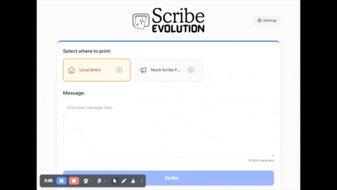
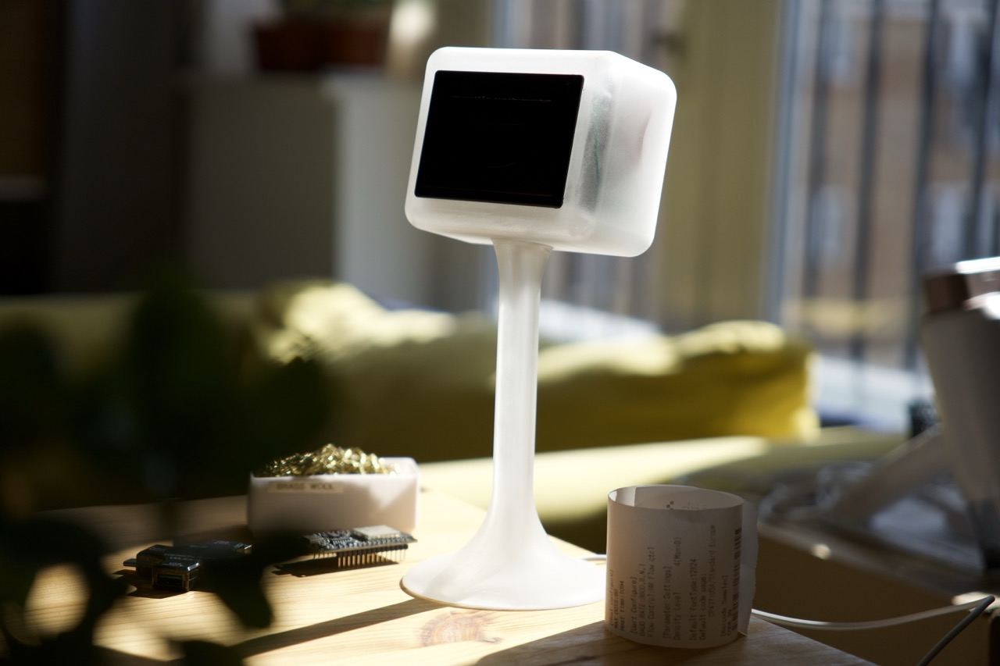

  <picture>
    <source media="(prefers-color-scheme: dark)" srcset="docs/assets/ScribeLogoMain-white.svg">
    <source media="(prefers-color-scheme: light)" srcset="docs/assets/ScribeLogoMain-black.svg">
    
  </picture>

 
 

  <table>
    <tr>
      <td width="50%">
        
      </td>
      <td width="50%">
        
      </td>
    </tr>
  </table>

**Print Magic. Share Securely. Poke Friends.**

Scribe Evolution is a delightful, small thermal printer you can use from your phone or laptop. Print quick notes, to‑dos, recipes, riddles, quotes, or little surprises. Keep it on a desk, the kitchen counter, or anywhere you want instant hard copy.

### Reasons to love it

- **Instant printing**: Tear‑and‑go notes in seconds — no ink, no fuss, on supercheap paper.
- **Use any device**: Use the friendly web app at `http://scribe‑[name].local`
- **Private by default**: Runs securely on your network.
- **Remote printing (optional)**: Print from anywhere — set up remote printing ([learn more](docs/mqtt-integration.md))
- **Semi-scheduled surprises**: “Unbidden Ink” (untested) posts fun content throughout your day
- **Share between friends or rooms**: Send any message between Scribe Evolution devices

## Quick Start

### 🚀 **Ready to Go?**

**👉 [Quick Start Guide - Flash the Pre-built Firmware →](docs/quick-start.md)**

Get your Scribe printer running in minutes with pre-built firmware. No coding changes needed.

---

### Hardware setup

- ESP32‑C3 Supermini
- CSN‑A4L thermal printer (or compatible) and paper
- 5V power supply (2.4A+ recommended, important)

To setup your hardware, check the [Hardware Guide](docs/hardware.md).

### Optional extras

The firmware also supports 4 x physical buttons and an addressable LED strip, but you can add these later. 

### Learn more

- **Quick Start**: [Flash pre‑built firmware](docs/quick-start.md)
- **Troubleshooting**: [Common issues and fixes](docs/troubleshooting.md)
- **Remote printing**: [MQTT integration](docs/mqtt-integration.md) and [Apple Shortcuts](docs/apple-shortcuts.md)
- **Docs index**: [See all guides](docs/index.md)

## Acknowledgments

See `ACKNOWLEDGEMENTS.md` for full credits and attributions.

## Disclaimer

See `DISCLAIMER.md`.

## License

Commercial use is not free — a commercial license is required. See `LICENSE` for full terms (CC BY‑NC‑SA 4.0).

© 2025 Adam Knowles. All rights reserved.
