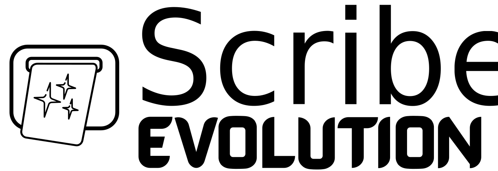

<picture>
  <source media="(prefers-color-scheme: dark)" srcset="docs/assets/ScribeLogoMain-white.svg">
  <source media="(prefers-color-scheme: light)" srcset="docs/assets/ScribeLogoMain.svg">
  
</picture>

<br>
<br>

**An AI-powered, network-connected thermal printer to bring you joy**

Scribe transforms a simple thermal printer into an intelligent, delightful device that can surprise you with jokes, help you with daily tasks, create ambient lighting effects, and integrate seamlessly into your smart home ecosystem.


### 🔑 **Features**
- **Physical Buttons**: Dedicated hardware controls for instant content generation
- **Content Library**: Curated collections of jokes, riddles, quotes, and trivia
- **LED Effects**: Add an LED strip for lighting awesomeness.
- **Apple Shortcuts Ready**: Print anything from your iPhone with a tap

### 🕸️ **Network-First Design**
- **MQTT Integration**: Network multiple printers, print from anywhere in the world
- **mDNS Discovery**: Access via `http://scribe-[devicename].local` - no IP hunting
- **Remote Control**: Print from iOS shortcuts, web services, or custom applications
- **Multi-Device Orchestration**: Coordinate content across multiple Scribe Evolution printers

### 🤖 **AI-Powered Content Generation**
- **Quick Fun Actions**: Instant jokes, quotes, riddles, weather reports, and daily news briefings
- **Unbidden Ink**: Scheduled AI-generated content that appears automatically throughout your day

### 🎛️ **Solid Build**
- **Web-Based Interface**: Responsive design works on phones, tablets, and desktops
- **Persistent Settings**: NVS storage preserves all configurations across firmware updates
- **Real-Time Diagnostics**: Monitor system health, memory usage, network status, and hardware
- **Comprehensive Logging**: Multiple output destinations including BetterStack integration

### 🛠️ **Developer Experience**
- **Modern Architecture**: Modular C++ codebase with proper separation of concerns
- **Build Automation**: Integrated npm and PlatformIO workflows
- **Configuration Management**: Centralized settings with environment-specific overrides
- **Documentation**: Extensive guides covering aspects of the system

## Quick Start

### 1. Hardware Setup
Build your Scribe printer following the [Hardware Guide](docs/hardware.md). You'll need:
- ESP32-C3 development board
- CSN-A4L thermal printer  
- 3D printed enclosure ([download files](https://makerworld.com/en/models/1577165-project-scribe))
- 5V power supply (2.4A+ recommended)

### 2. Software Configuration
```bash
# Create your configuration file
cp src/config.h.example src/config.h

# Edit src/config.h with your settings:
# - WiFi credentials
# - MQTT broker (optional)
# - Timezone preferences
```

### 3. Build and Deploy
```bash
# Install dependencies
npm install

# Build and upload everything
pio run --target upload_all
```

### 4. Access Your Printer
- **Local**: http://scribe-[devicename].local or use IP address from boot message
- **Remote**: Configure MQTT for printing from anywhere

> **Need help?** See the [Build Instructions](docs/build-instructions.md) for detailed setup steps.

## 📚 Documentation

### Getting Started
- **[Build Instructions](docs/build-instructions.md)** - Complete setup guide: PlatformIO, npm, dependencies
- **[Hardware Guide](docs/hardware.md)** - BOM, wiring, assembly, and 3D printing
- **[Microcontroller Firmware](docs/microcontroller-firmware.md)** - Development environment and code architecture

### Integration & Automation  
- **[MQTT Integration](docs/mqtt-integration.md)** - Multi-printer networking and remote control
- **[Pipedream Integration](docs/pipedream-integration.md)** - Serverless HTTP-to-MQTT bridge
- **[Apple Shortcuts](docs/apple-shortcuts.md)** - Print from iOS using HTTP-to-MQTT bridges

### System Administration
- **[Logging System](docs/logging-system.md)** - Multi-destination logging and monitoring  
- **[Configuration System](docs/configuration-system.md)** - Dual-layer config architecture
- **[Troubleshooting](docs/troubleshooting.md)** - Common issues, diagnostics, and solutions

### Development & Customization
- **[Code Structure](docs/code-structure.md)** - Modular architecture and development guidelines
- **[LED Effects](docs/led-effects.md)** - Optional LED system with cycle-based effects
- **[Testing Guide](docs/testing.md)** - Unit testing and validation procedures

## Credits and Acknowledgments

### Riddles Collection

The riddles feature uses a collection of riddles curated by **Nikhil Mohite**
from the [riddles-api](https://github.com/nkilm/riddles-api) project. This
collection is provided under the MIT License.

- **Original Repository:** https://github.com/nkilm/riddles-api
- **Author:** Nikhil Mohite
- **License:** MIT License

I thank Nikhil for making this wonderful collection of riddles available to the
open source community.

### Original Project

Credit to **UrbanCircles** for the original Project Scribe concept, 3D
model, and initial codebase that inspired Scribe Evolution.

## Disclaimer

I've done my best to document everything accurately - however, there might be
mistakes. If you see them, or opportunities to improve, please open an issue.  
This is an open-source project given for free, with no warranties or guarantees.
It assumes a level of proficiency with electronics, assemblies, engineering,
etc. Do your own due diligence - it's your responsibility. Stay safe. Stay
productive. Work with what you have. Make the world a better place.

## License

This project is licensed under the **Creative Commons
Attribution-NonCommercial-ShareAlike 4.0 International License**.

### What this means:

✅ **You are free to:**

- **Share** — copy and redistribute the material in any medium or format
- **Adapt** — remix, transform, and build upon the material

⚠️ **Under the following terms:**

- **Attribution** — You must give appropriate credit to Adam Knowles, provide a
  link to the license, and indicate if changes were made
- **NonCommercial** — You may not use the material for commercial purposes
  without explicit written permission
- **ShareAlike** — If you remix, transform, or build upon the material, you must
  distribute your contributions under the same license

### Commercial Use

**Commercial use is prohibited without a licensing agreement.** If you wish to
use this project commercially (including but not limited to selling products
based on this design, using it in commercial environments, or incorporating it
into commercial software), please contact the author.

### Full License

You can view the full license text at:
https://creativecommons.org/licenses/by-nc-sa/4.0/

### Copyright

© 2025 Adam Knowles. All rights reserved.

**Original Project:** This project, with a new foundation for the codebase, was inspired by the original Project Scribe by UrbanCircles.