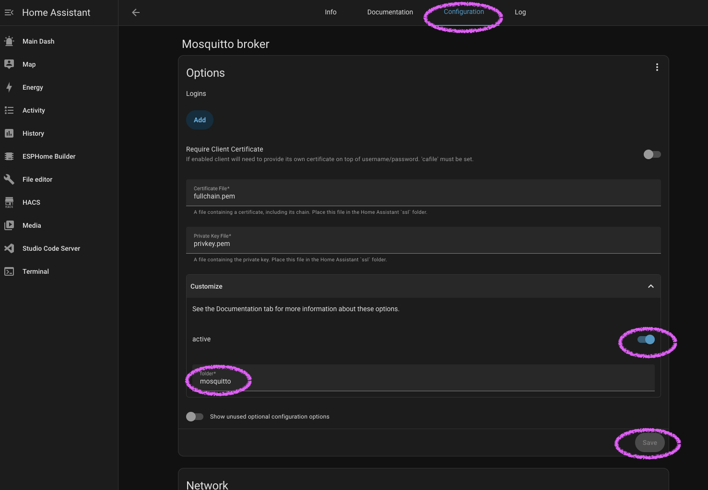
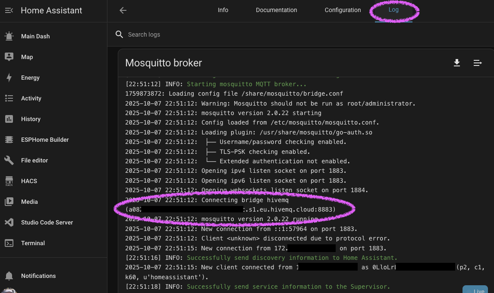
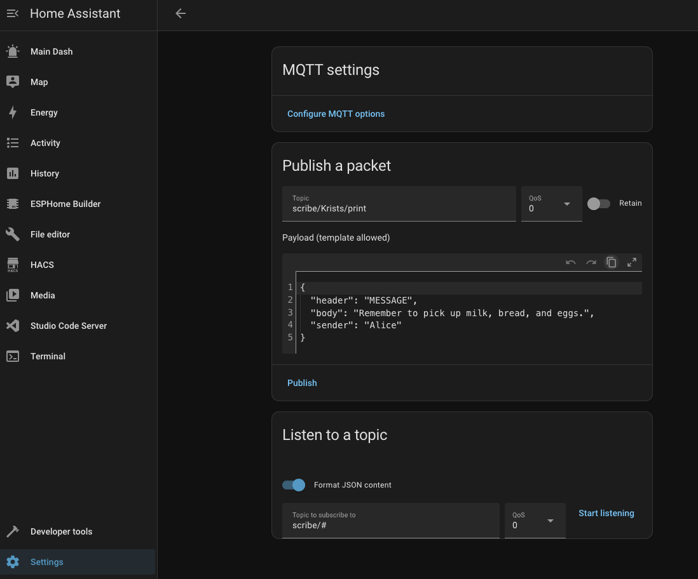
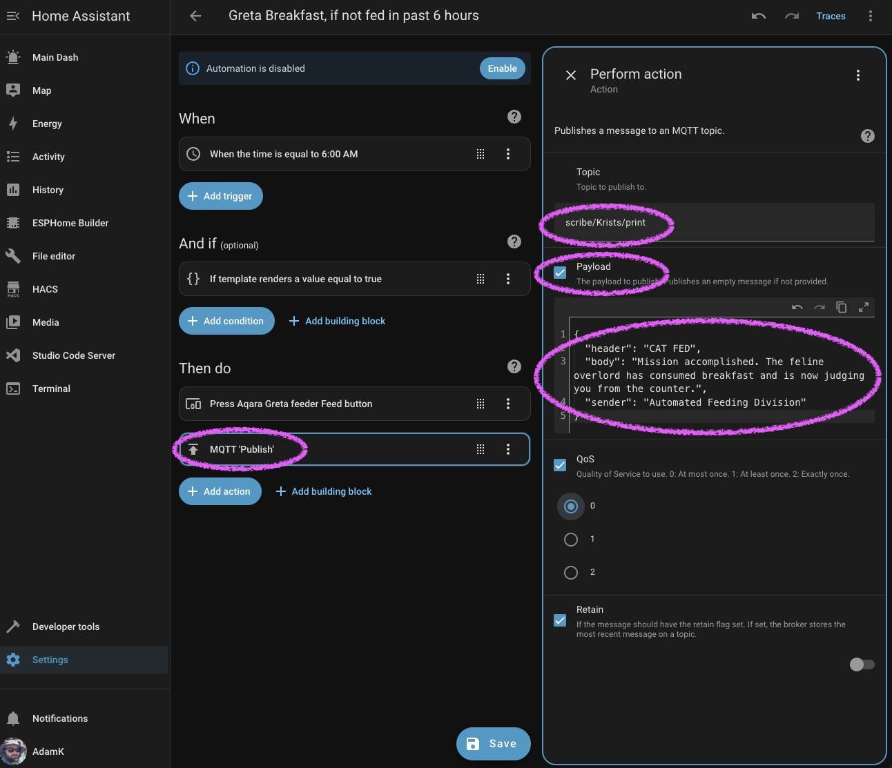
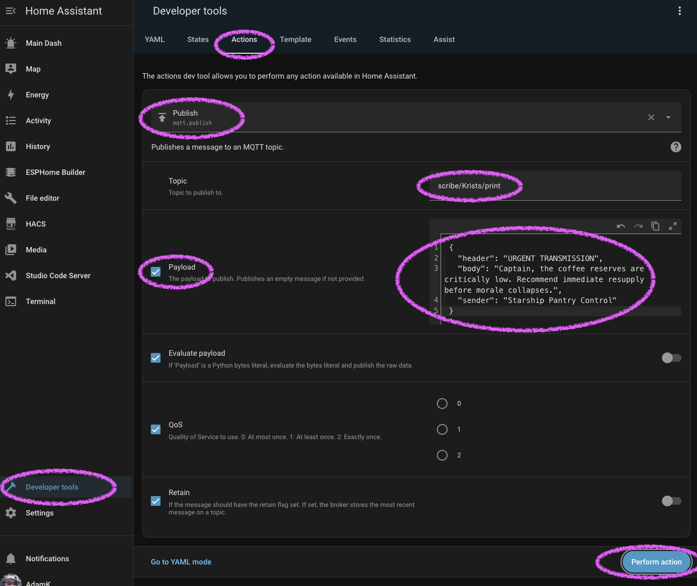

# Home Assistant Integration via MQTT Bridge

This guide shows you how to integrate your Scribe Evolution printer with Home Assistant.

Create an MQTT bridge between Home Assistant's Mosquitto broker and HiveMQ Cloud. Then you can **print to Scribe Evolution from Home Assistant**, including from automations, service calls, scripts etc.

```
Home Assistant (Mosquitto) ←→ MQTT Bridge ←→ HiveMQ Cloud ←→ Scribe Evolution
```

- Turned off the light? Print a receipt. Collect ten for a prize.
- Heating too high? Log that on paper so you can show your landlord.
- Fed the cat? Print a record for the vet's files.

## Prerequisites

Before starting, you need:

- ✅ Home Assistant running with **Mosquitto Broker add-on** installed (Settings > Add-ons > Mosquitto broker)

> ⚠️ This guide used **Home Assistant Green** with **Mosquitto Broker add-on v2.0.22**.

- ✅ Your own **HiveMQ Cloud** instance - see [MQTT Integration Guide](mqtt-integration.md). You'll need your MQTT hostname, port, username and password
- ✅ **Studio Code Server** or **SSH** Home Assistant add-on installed to edit the config files. Sorry, not all of this can be done in the UI. File Editor cannot access the necessary folder, `/share`.

## Step 1: Create a Bridge Configuration File

1. Open **Studio Code Server** in Home Assistant
2. Create the folder: `/share/mosquitto/` (right-click is one way)
3. Create a new file: `bridge.conf` (right-click again)

Path:

```
/share/mosquitto/bridge.conf
```

4. Paste the following configuration. Then **replace** the placeholders:

```conf
connection hivemq
addresses a08something.s1.eu.hivemq.cloud:8883
remote_username <your-hivemq-user>
remote_password <your-hivemq-pass>

# IDs
local_clientid ha-mosq
remote_clientid ha-bridge

# Protocol + session
bridge_protocol_version mqttv311
try_private false
cleansession true
keepalive_interval 60
restart_timeout 30
notifications false

# TLS (HiveMQ Cloud requires it)
bridge_cafile /etc/ssl/certs/ca-certificates.crt
bridge_insecure false
bridge_tls_version tlsv1.2

# Topic routing
# Mirror Scribe messages both ways
topic scribe/# both 0
```

## Step 2: Enable Custom Configuration in Mosquitto

The following steps tells Mosquitto to check the /share/mosquitto/ folder for additional configs, of which your new file bridge.conf is one.

1. Go to **Settings** → **Add-ons** → **Mosquitto Broker**
2. Select the **Configuration** tab
3. In "Options", toggle "Show unused optional configuration options"
4. Set Customize > active: ON. Leave customize folder as default: mosquitto
5. Select **Save**
6. This should restart the Mosquitto Broker add-on



## Step 3: Done! Check it works

### Check Mosquitto logs

1. Go to **Mosquitto Broker** → **Logs** tab
2. Look for a log entry:
   ```
      Connecting bridge hivemq (...)
   ```

> 💡 Connection success seems NOT to generate a log entry, at least with my logging levels.



### Test HiveMQ → Home Assistant

1. In Home Assistant, go to **Settings** → **Devices & Services** → **MQTT** → **"Configure" Cog**
2. Select **Listen to a topic**
3. Enter topic: `scribe/#` (means everything under scribe/)
4. Select **Start listening**
5. Publish a test message to your HiveMQ MQTT e.g.:
   ```json
   {
     "topic": "scribe/test/inbox",
     "payload": { "test": "fromHiveMQ" }
   }
   ```
6. You should see the message appear in Home Assistant



### Test Home Assistant → HiveMQ

1. On same screen as above (**Settings** → **Devices & Services** → **MQTT** → **"Configure" Cog**)
2. Select **Publish a packet**
3. Enter:
   ```json
   {
     "header": "MESSAGE",
     "body": "Remember to pick up milk, bread, eggs and kitty treats.",
     "sender": "Harold"
   }
   ```
4. Select **Publish**
5. Check your HiveMQ MQTT via e.g. HiveMQ Cloud console, MQTT Explorer. Confirm the message arrived.

## Enjoy!

Now you can send messages to your Scribe Evolution printer from Home Assistant automations.

### Example Automation

#### Via UI

You can trigger an MQTT print from an automation via the UI, for example:



#### YAML

```yaml
automation:
  - alias: "Print morning greeting to Scribe Evolution"
    trigger:
      - platform: time
        at: "07:00:00"
    action:
      - service: mqtt.publish
        data:
          topic: "scribe/YourPrinterName/print"
          payload: >
            {
              "header": "GOOD MORNING",
              "body": "Today is {{ now().strftime('%A, %B %d') }}. Have a great day!",
              "sender": "HomeAssistant"
            }
```

### Developer Tools: Trigger a Print

You can manually publish to your Scribe topic using **Developer Tools** → **Actions**.

1. Type "mqtt" in search bar and choose "Publish" action
2. Set topic for your printer e.g.

```json
  scribe/Krists/print
```

1. Tick **Payload** then paste:

   ```json
   {
     "header": "URGENT TRANSMISSION",
     "body": "Captain, the coffee reserves are critically low. Recommend immediate resupply before morale collapses.",
     "sender": "Starship Pantry Control"
   }
   ```

2. Click **Perform action**

This sends the structured MQTT message via your local Mosquitto bridge to HiveMQ and on to your Scribe Evolution device.



## Related Documentation

- [MQTT Integration Guide](mqtt-integration.md) - Set up HiveMQ Cloud
- [Pipedream Integration](pipedream-integration.md) - HTTP→MQTT bridge for external services
- [Apple Shortcuts Integration](apple-shortcuts.md) - Print from iOS/macOS

---

For questions or issues, please create an issue in the repository.
