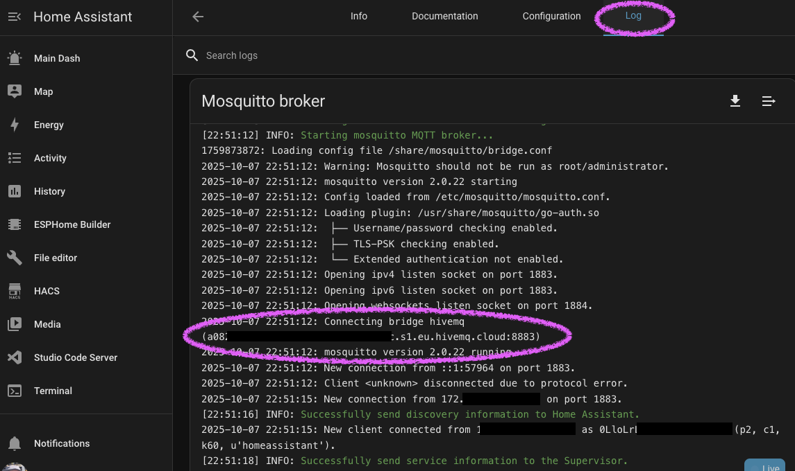

# Home Assistant OS / Supervised – MQTT Bridge Setup

This guide is for **Home Assistant OS** or **Supervised** installations using the **Mosquitto Broker add-on**.

> ⚠️ This guide was tested with **Home Assistant Green** using **Mosquitto Broker add-on v2.0.22**.

[← Back to setup guide selection](README.md)

---

## Prerequisites

- Home Assistant OS or Supervised installation
- **Mosquitto Broker add-on** installed (Settings → Add-ons → Mosquitto broker)
- **Studio Code Server** or **SSH** add-on installed (to edit `/share/` files)
- Your **HiveMQ Cloud** credentials - see [MQTT Integration Guide](../mqtt-integration.md)

---

## Step 1: Create Bridge Configuration File

1. Open **Studio Code Server** in Home Assistant
2. Create the folder: `/share/mosquitto/` (right-click → New Folder)
3. Create a new file: `/share/mosquitto/bridge.conf`

Paste the following configuration and **replace the placeholders**:

```conf
connection hivemq
addresses a08something.s1.eu.hivemq.cloud:8883
remote_username <your-hivemq-user>
remote_password <your-hivemq-pass>

# IDs
local_clientid ha-mosq
remote_clientid ha-bridge

# Protocol + session
bridge_protocol_version mqttv311
try_private false
cleansession true
keepalive_interval 60
restart_timeout 5 30
notifications false

# TLS (HiveMQ Cloud requires it)
bridge_cafile /etc/ssl/certs/ca-certificates.crt
bridge_insecure false
bridge_tls_version tlsv1.2

# Topic routing
# Mirror Scribe messages both ways
topic scribe/# both 0
```

---

## Step 2: Enable Custom Configuration in Add-on

1. Go to **Settings** → **Add-ons** → **Mosquitto Broker**
2. Select the **Configuration** tab
3. Toggle "Show unused optional configuration options"
4. Set **Customize** → **active: ON**
5. Leave **folder** as default: `mosquitto`
6. Select **Save**

The add-on will automatically restart.

**Example configuration:**

```yaml
customize:
  active: true
  folder: mosquitto
```


---

## Step 3: Verify Connection

### Check Mosquitto Logs

1. Go to **Mosquitto Broker** → **Logs** tab
2. Look for:
   ```
   Connecting bridge hivemq (...)
   ```

> 💡 Connection success may not generate a log entry depending on your logging level.



---

## Step 4: Test the Bridge

### Test HiveMQ → Home Assistant

1. Go to **Settings** → **Devices & Services** → **MQTT** → **Configure**
2. Select **Listen to a topic**
3. Enter topic: `scribe/#`
4. Select **Start listening**
5. Publish a test message to your HiveMQ broker:
   ```json
   {
     "header": "KITTY UPDATE",
     "body": "Subject has completed zoomies and entered loaf mode. Purring intensity: medium-high.",
     "sender": "Feline Observation Unit"
   }
   ```
6. You should see the message appear in Home Assistant


### Test Home Assistant → HiveMQ

1. On the same screen, select **Publish a packet**
2. Topic: `scribe/inbox`
3. Payload:
   ```json
   {
     "header": "MESSAGE",
     "body": "Remember to pick up milk, bread, eggs and kitty treats.",
     "sender": "Harold"
   }
   ```
4. Select **Publish**
5. Check HiveMQ Cloud console or MQTT Explorer to confirm the message arrived

---

## Done!

Now you can send messages to your Scribe Evolution printer from Home Assistant automations.

### Example Automation

#### Via UI

You can trigger an MQTT print from an automation via the UI:


#### YAML

```yaml
automation:
  - alias: "Print morning greeting to Scribe Evolution"
    trigger:
      - platform: time
        at: "07:00:00"
    action:
      - service: mqtt.publish
        data:
          topic: "scribe-evolution/print/YourPrinterName"
          payload: >
            {
              "header": "GOOD MORNING",
              "body": "Today is {{ now().strftime('%A, %B %d') }}. Have a great day!",
              "sender": "HomeAssistant"
            }
```

### Developer Tools: Trigger a Print

Manually publish to your Scribe topic using **Developer Tools** → **Actions**:

1. Type "mqtt" in search bar and choose "Publish" action
2. Set topic: `scribe-evolution/print/Krists`
3. Tick **Payload** then paste:
   ```json
   {
     "header": "URGENT TRANSMISSION",
     "body": "Captain, the coffee reserves are critically low. Recommend immediate resupply before morale collapses.",
     "sender": "Starship Pantry Control"
   }
   ```
4. Click **Perform action**


---

## Related Documentation

- [MQTT Integration Guide](../mqtt-integration.md) - Set up HiveMQ Cloud
- [Pipedream Integration](../pipedream-integration.md) - HTTP→MQTT bridge
- [Apple Shortcuts Integration](../apple-shortcuts.md) - Print from iOS/macOS

[← Back to setup guide selection](README.md)
