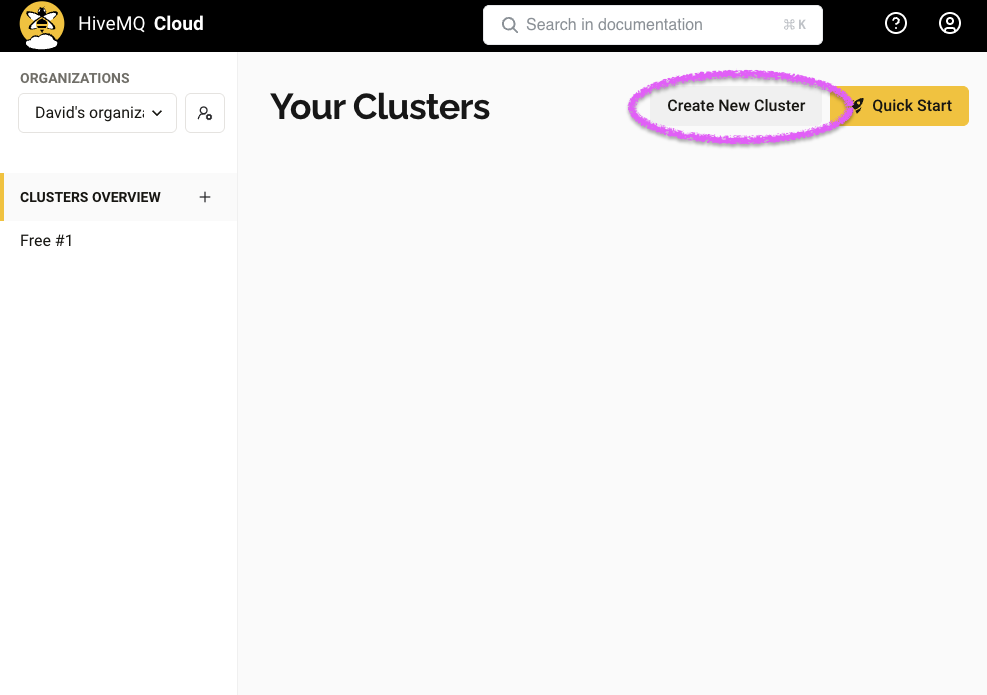
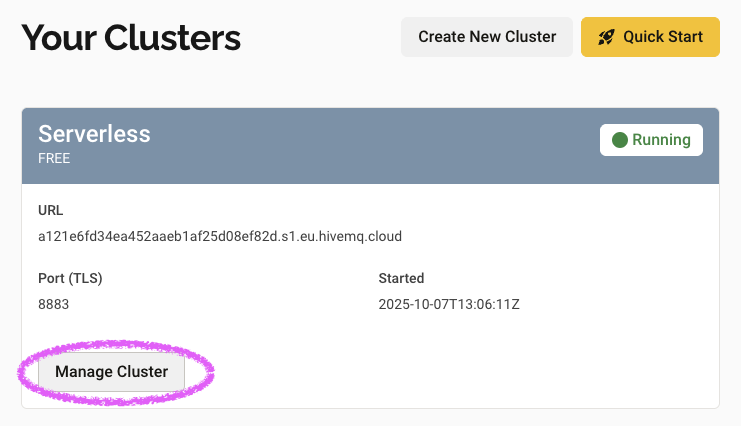
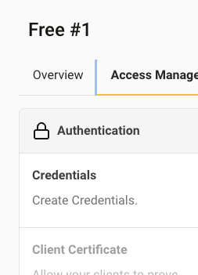
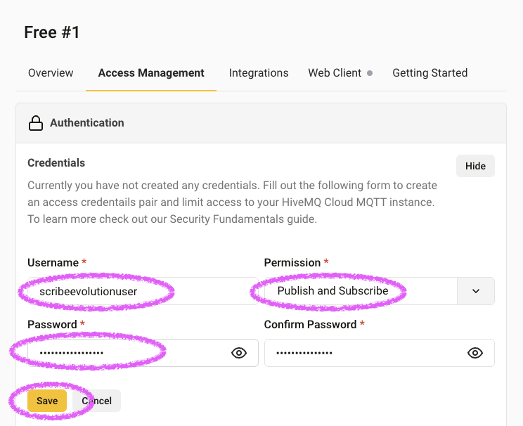
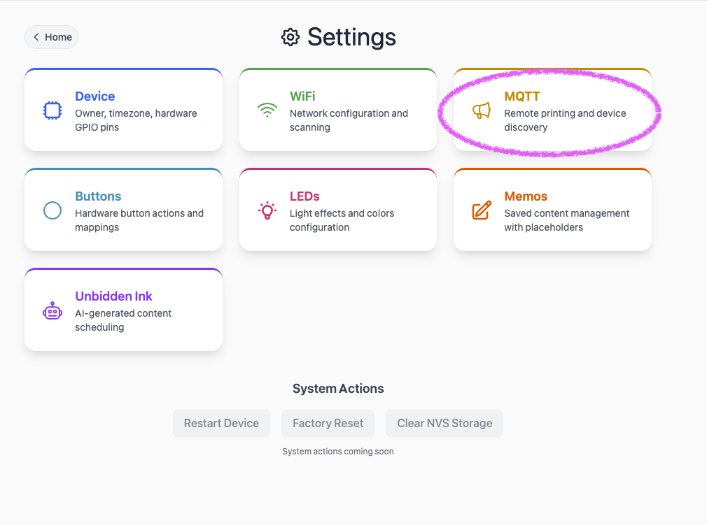
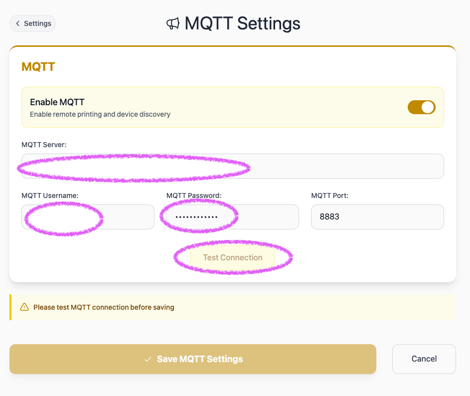

# MQTT Integration Guide

This guide shows you how to set up remote printing for your Scribe Evolution device using MQTT and HiveMQ Cloud.

## Step 1: Set Up HiveMQ Cloud

HiveMQ Cloud is a free MQTT broker service that routes messages between your devices and services.

### Create Your HiveMQ Account and Cluster

1. Go to [console.hivemq.cloud](https://console.hivemq.cloud) and select **Sign up**
2. Verify your email address
3. Log in and select **Create cluster**
4. Choose the **Free** plan
5. Select **Create New Cluster**



6. "Create Serverless Cluster"


### Get Your Cluster Connection Details

Once your cluster is running:

1. Select your cluster name to open the details page
2. This is where you will find your
   - **MQTT Host** (e.g., `a1b2c3d4.s1.eu.hivemq.cloud`)
   - **MQTT Port** (should be `8883` for secure connections)

### Create MQTT Credentials

Now create a username and password for your Scribe Evolution printer(s) to use:

1. Select "Manage Cluster"

   

2. Select **Access Management** and "Edit"

   

3. Invent and note down a username (e.g., `scribeevolutionuser` or `scribe_devices`) and password
4. Set **Permissions** to **Publish and Subscribe**

   

## Step 2: Configure Your Scribe Evolution

Now connect your Scribe Evoluton to your HiveMQ cluster:

1. Open your Scribe Evolution web interface (e.g., `http://scribe-yourname.local`)
2. Go to **Settings** → **MQTT**

   

3. **Enable MQTT** (toggle switch)
4. Enter your HiveMQ details:
   - **Server**: Your HiveMQ host (e.g., `a1b2c3d4.s1.eu.hivemq.cloud`)
   - **Port**: `8883`
   - **Username**: The username you created (e.g., `adammain`)
   - **Password**: The password you copied earlier

5. Select **Test Connection**
6. Wait for success confirmation

   

7. Select **Save**

> ⚠️ **Troubleshooting**: If the test fails, double-check your username, password, and that port is `8883` (not `1883` or `8884`).

## Next Steps

### Connect Scribe Evolution Printers Together

1. Use the same MQTT credentials for all Scribe Evolution printers in your private network.
2. Printers will auto-detect each other, instantly.
3. Send messages, joke, news, poke!

### Send Messages From Other Devices

To print something, send a structured MQTT message. This might include messages from web services, Apple Shortcuts, Home Assistant, or other apps, see:

- **[Pipedream Integration Guide](pipedream-integration.md)** - Recommended HTTP-to-MQTT bridge (works with Home Assistant, IFTTT, Zapier, etc.)
- **[Apple Shortcuts Integration](apple-shortcuts.md)** - iOS/macOS automation

---

## Advanced Reference

### Understanding Topic Names

Your printer automatically subscribes to messages sent to:

```
scribe/{your-device-name}/print
```

The device name comes from **Settings** → **Device** → **Owner name**. For example:

- If your device name is "Alice", your topic is `scribe/alice/print`
- If your device name is "Office-Main", your topic is `scribe/office-main/print`

### Message Format Specification

Scribe Evolution expects a structured JSON payload over MQTT with `header`, `body`, and `sender`. The device prints `header from sender`, a blank line, then `body`.

**Required fields:**

- `header` string: e.g. `"MESSAGE"`, `"JOKE"`, `"RIDDLE"`, `"QUOTE"`, `"QUIZ"`, or `"MEMO 1"`–`"MEMO 4"`.
- `body` string: the content to print.
- `sender` string: identifies who sent the message (appended to header as "[header] from [sender]").

**Example payloads:**

```json
{
  "header": "MESSAGE",
  "body": "Remember to pick up milk, bread, and eggs.",
  "sender": "Alice"
}
```

```json
{
  "header": "JOKE",
  "body": "Why did the scarecrow win an award? Because he was outstanding in his field!",
  "sender": "Bob"
}
```

**Memo placeholders** (expanded by the printer when header starts with MEMO):

Valid placeholders: `[date]`, `[time]`, `[weekday]`, `[coin]`, `[dice]`, `[dice:N]`, `[pick:A|B|C]`, `[uptime]`, `[ip]`, `[mdns]`

```json
{
  "header": "MEMO 1",
  "body": "Today is [weekday], [date] at [time]. Coin flip: [coin]",
  "sender": "System"
}
```

### Using Device HTTP API to Publish

POST `/api/print-mqtt`

```json
{
  "topic": "scribe/alice/print",
  "header": "MESSAGE",
  "body": "Hello from REST",
  "sender": "API Client"
}
```
