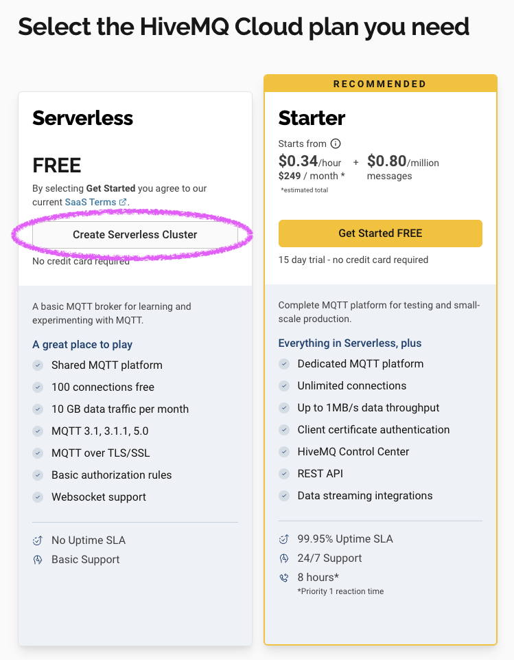

# MQTT Integration Guide

This guide shows you how to set up remote printing for your Scribe Evolution device using MQTT and HiveMQ Cloud.

## Why Use MQTT?

MQTT unlocks powerful ways to use your Scribe printer:

- 🖨️ **Print from anywhere in the world** - Send messages while you're at work, on vacation, or traveling
- 👥 **Share with friends and family** - Let others send messages to your printer (and you to theirs)
- 🏠 **Connect your smart home** - Printer responds to calendar reminders, weather alerts, door sensors, timers, and more
- 📱 **Use any app or service** - Apple Shortcuts, Zapier, home automation, custom scripts - anything that can send HTTP requests
- 🔒 **Stay secure** - No need to expose your home network to the internet

## Step 1: Set Up HiveMQ Cloud

HiveMQ Cloud is a free MQTT broker service that routes messages between your devices and services.

### Create Your HiveMQ Account and Cluster

1. Go to [console.hivemq.cloud](https://console.hivemq.cloud) and click **Sign up**
2. Verify your email address
3. Log in and click **Create cluster**
4. Choose the **Free** plan
5. Select a cluster region close to you
6. Click **Create**
7. Wait 1-2 minutes for your cluster to deploy

### Get Your Cluster Connection Details

Once your cluster is running:

1. Click on your cluster name to open the details page
2. **Note down these values** (you'll need them later):
   - **Host** (e.g., `a1b2c3d4.s1.eu.hivemq.cloud`)
   - **Port** (should be `8883` for secure connections)


### Create MQTT Credentials

Now create a username and password for your Scribe devices:

1. In your cluster details, click **Access Management** (left sidebar)

   

2. Click **Add Credentials**

   

3. Enter a username (e.g., `adammain` or `scribe_devices`)
4. Set **Permissions** to **Publish and Subscribe**

   

5. Click **Add**
6. **Copy the generated password** - you cannot view it again!

   

7. Store the username and password somewhere safe

> 💡 **Tip**: You can create separate credentials for different devices or users for better security and access tracking.

### Optional: Verify Topic Access

Your credentials should automatically have access to all topics. To verify or restrict access:

1. In **Access Management**, click on your credential
2. Under **Topic Permissions**, verify it shows `#` (all topics) with Publish & Subscribe
3. To restrict access, you can set specific patterns like `scribe/+/print`


## Step 2: Configure Your Scribe Device

Now connect your Scribe printer to your HiveMQ cluster:

1. Open your Scribe web interface (e.g., `http://scribe-yourname.local`)
2. Go to **Settings** → **MQTT**
3. **Enable MQTT** (toggle switch)
4. Enter your HiveMQ details:
   - **Server**: Your HiveMQ host (e.g., `a1b2c3d4.s1.eu.hivemq.cloud`)
   - **Port**: `8883`
   - **Username**: The username you created (e.g., `adammain`)
   - **Password**: The password you copied earlier

   

5. Click **Test Connection**
6. Wait for success confirmation

   

7. Click **Save**

> ⚠️ **Troubleshooting**: If the test fails, double-check your username, password, and that port is `8883` (not `1883` or `8884`).

### Understanding Topic Names

Your printer automatically subscribes to messages sent to:

```
scribe/{your-device-name}/print
```

The device name comes from **Settings** → **Device** → **Owner name**. For example:

- If your device name is "Alice", your topic is `scribe/alice/print`
- If your device name is "Office-Main", your topic is `scribe/office-main/print`

## Step 3: Test Your Connection

Let's send a test message to verify everything works!

### Using Your Scribe Web Interface

The easiest way to test:

1. In your Scribe web interface, go to **Remote Printers**
2. Add your own printer as a remote printer (yes, printing to yourself!)
3. Enter your device name
4. Send a test message
5. Your printer should print it!

### Using Command Line (Advanced)

If you have `mosquitto_pub` installed:

```bash
mosquitto_pub -h a1b2c3d4.s1.eu.hivemq.cloud -p 8883 \
  -u adammain -P your-password \
  --cafile isrg-root-x1.pem \
  -t "scribe/alice/print" \
  -m '{"header":"MESSAGE","body":"Hello from command line!","sender":"Test"}'
```

Replace:

- `a1b2c3d4.s1.eu.hivemq.cloud` with your HiveMQ host
- `adammain` with your username
- `your-password` with your password
- `alice` with your device name

## Next Steps

### Send Messages from the Internet

To send messages from web services, Apple Shortcuts, or other apps, see:

- **[Pipedream Integration Guide](pipedream-integration.md)** - Recommended HTTP-to-MQTT bridge
- **[Apple Shortcuts Integration](apple-shortcuts.md)** - iOS/macOS automation

### Connect Multiple Printers

Want to print to friends' printers?

1. Both of you complete HiveMQ setup (you can share the same cluster)
2. Both of you use the same MQTT credentials
3. In your Scribe web interface, add their printer under **Remote Printers**
4. Start sending messages!

---

## Advanced Reference

### Message Format Specification

Scribe expects a structured JSON payload over MQTT with at least `header` and `body`. The device prints `header`, a blank line, then `body`.

**Required fields:**

- `header` string: e.g. `"MESSAGE"`, `"JOKE"`, `"RIDDLE"`, `"QUOTE"`, `"QUIZ"`, or `"MEMO 1"`–`"MEMO 4"`.
- `body` string: the content to print.

**Optional fields:**

- `sender` string: appended to header as "<header> from <sender>".
- `timestamp` string: ignored on receipt; device adds its own on print.

**Example payloads:**

```json
{
  "header": "MESSAGE",
  "body": "Remember to pick up milk, bread, and eggs.",
  "sender": "Alice"
}
```

```json
{
  "header": "JOKE",
  "body": "Why did the scarecrow win an award? Because he was outstanding in his field!"
}
```

**Memo placeholders** (expanded by the printer when header starts with MEMO):

```json
{
  "header": "MEMO 1",
  "body": "Meet at {{time}} in {{room}}"
}
```

### Using Device HTTP API to Publish

POST `/api/print-mqtt`

```json
{
  "topic": "scribe/alice/print",
  "header": "MESSAGE",
  "body": "Hello from REST"
}
```

### Alternative MQTT Broker Options

While we recommend HiveMQ Cloud for ease of use, you can use other brokers:

**Other Cloud Brokers:**

- **AWS IoT Core** - Part of AWS ecosystem, certificate-based authentication, pay-per-use
- **Azure IoT Hub** - Microsoft's IoT platform, device management features, free tier available

**Self-Hosted Options:**

- **Mosquitto** - Lightweight, popular choice
- **EMQX** - High-performance, web dashboard
- **VerneMQ** - Distributed, scalable

### GUI MQTT Testing Tools

If command line isn't your thing, try these visual tools:

- **MQTT Explorer** - Visual topic browser
- **MQTTX** - Cross-platform client
- **HiveMQ Web Client** - Browser-based testing

### Home Automation Integration

**Home Assistant** example action:

```yaml
service: mqtt.publish
data:
  topic: scribe/kitchen/print
  payload: |
    {"header":"MESSAGE","body":"Good morning! Coffee is ready."}
```

**Node-RED:**
Create flows that trigger printing based on:

- Weather alerts
- Calendar events
- Sensor readings
- Time-based schedules

### Security Notes

- **TLS Encryption**: Connections use TLS with CA verification (ISRG Root X1)
- **Trust Model**: Payloads aren't signed; printers trust messages that reach their subscribed topic. Protect topics via broker authentication and ACLs.
- **Credentials**: Device avoids logging secrets; keep broker credentials private; prefer per-device users for better security and access tracking

### Troubleshooting

**Messages not printing:**

- Verify topic name matches your device name configuration
- Check JSON format validity
- Monitor for MQTT delivery confirmation
- Check printer hardware and paper

**Delayed messages:**

- Check broker message queue
- Verify network latency
- Monitor broker performance
- Consider local broker for latency-sensitive applications

**Connection issues:**

- Verify credentials and port (should be `8883` for secure)
- Check firewall isn't blocking MQTT traffic
- Test with MQTT client tools first
- Review Diagnostics page for connection status and errors

**Enable verbose logging** in `config.h`:

```cpp
static const int logLevel = LOG_LEVEL_VERBOSE;
```

Monitor serial output for detailed MQTT connection and message processing logs.
